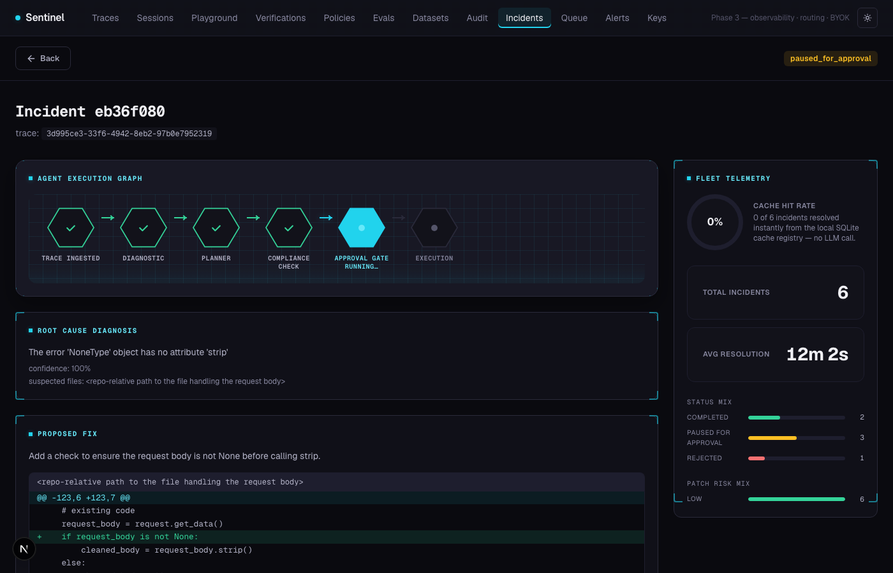

# Sentinel

[](https://github.com/Siddharthpatni/Sentinel/actions/workflows/ci.yml)
[](LICENSE)

**The self-hosted observability platform that automatically investigates and
explains failing LLM calls.**

Point your app at Sentinel instead of OpenAI/Anthropic directly. Every call
gets traced. When one fails or looks risky, an agent reproduces the failure
against your own codebase, explains the root cause, proposes a fix, and
opens a PR — gated by a deterministic risk check and a human approval step.
Runs fully offline against a local model if you want zero cloud dependency.



```bash
git clone https://github.com/Siddharthpatni/Sentinel.git
cd Sentinel
export OPENAI_API_KEY=sk-...     # any real OpenAI key (seed costs <$0.01)
make demo                        # boots the stack, seeds traces + a live incident
```

Open <http://localhost:3000/incidents> — a synthetic incident is already
running through the agent graph.

## Why

Most LLM observability tools stop at "here's what happened." Sentinel's
triage agent is the part that's actually novel:

- **It debugs itself.** A failing trace → root-cause diagnosis (RAG over
  your codebase) → a real unified-diff patch → a PR. Not a chatbot
  suggestion — a state machine you can watch run, node by node.
- **It's self-hostable and offline.** Point `TRIAGE_LLM_MODEL` at a local
  Ollama model and the whole loop — diagnosis, patch generation, embeddings
  — runs on your machine. No API key, $0 marginal cost.
- **It doesn't trust itself.** A deterministic (non-LLM) compliance gate
  scores every patch's blast radius. Anything touching auth, payments,
  migrations, or more than a few files stops for a human. Auto-apply is
  the exception, not the default.

Everything else you'd expect from an observability proxy — cost/latency
traces, span waterfalls, evals, routing fallback, an audit ledger, BYOK
multi-tenant auth — is here too, but it's supporting infrastructure for the
triage agent, not sixteen separate pitches. See [Also included](#also-included).

## How it works

```
Your app → Sentinel Gateway → OpenAI / Anthropic / local Ollama
              │
              ├─ every call → traced → dashboard
              │
              └─ failing/high-risk call → triage agent:
                   diagnose → propose patch → risk-gate → [human approval] → PR
```

## Benchmark

Gateway overhead, measured locally (15 requests each, median; see
[docs/architecture.md](docs/architecture.md) for methodology):

| | Direct to model | Through Sentinel | Overhead |
|---|---|---|---|
| Latency | 196ms | 232ms | **+36ms** |

That's auth, risk classification, routing-policy check, and trace
persistence (async, off the request path) — not a second network hop to a
SaaS backend, since there isn't one.

## Sentinel vs. the alternatives

| | Sentinel | LangSmith | Langfuse | Phoenix |
|---|:---:|:---:|:---:|:---:|
| Self-host | ✅ | ❌ | ✅ | ✅ |
| Autonomous incident triage + PR | ✅ | ❌ | ❌ | ❌ |
| Fully offline (local LLM) | ✅ | ❌ | ❌ | ❌ |
| Drop-in proxy SDK | ✅ | ❌ | ❌ | ❌ |
| Tracing, evals, routing, audit log | ✅ | ✅ | ✅ | partial |

## Quick start

```bash
git clone https://github.com/Siddharthpatni/Sentinel.git
cd Sentinel
export OPENAI_API_KEY=sk-...
make demo
```

`make demo` boots the stack, seeds ~12 traces + a span tree + a routing
policy + a verification rule + a dataset, fires a synthetic incident
through the triage agent, and opens the dashboard. Total OpenAI cost under
$0.01 — triage itself defaults to the local Ollama model, so that part is
$0 regardless.

Bring your own traffic instead:

```bash
docker compose up -d
# point your existing OpenAI/Anthropic client at http://localhost:8000
```

```python
from sentinel import OpenAI          # was: from openai import OpenAI
client = OpenAI(
    sentinel_url="http://localhost:8000",
    sentinel_api_key="sk-sentinel-dev-000",
    provider_api_key="sk-...",       # your real OpenAI key
)
# client.chat.completions.create(...) works exactly as before.
```

Full SDK API: [sdk/README.md](sdk/README.md).

## Running triage fully offline

```bash
brew install ollama && ollama serve
ollama pull qwen2.5-coder:7b
make reindex          # embeds the codebase locally for RAG retrieval
```

`TRIAGE_LLM_MODEL` already defaults to `ollama/qwen2.5-coder:7b` and
embeddings run locally via sentence-transformers — nothing else to
configure. A SQLite cache registry sits in front of the LLM calls: exact
or semantically-similar (cosine ≥ 0.88) recurring incidents replay from
cache in single-digit milliseconds instead of re-running diagnosis.

## Also included

- **Observability** — cost/latency/token traces, span-tree waterfalls,
  provider/model/status filters.
- **Evals** — YAML suites, 7 assertion types, CI entrypoint.
  [docs/evals.md](docs/evals.md)
- **Routing & fallback** — ordered candidate models with automatic
  failover. [docs/routing.md](docs/routing.md)
- **EU AI Act audit ledger** — SHA-256-chained, offline-verifiable.
  [docs/audit.md](docs/audit.md)
- **Alerts** — cost/error-rate/latency threshold checks.
  [docs/alerts.md](docs/alerts.md)
- **Multi-tenant auth** — orgs, memberships, scoped per-project API keys.
- **BYOK** — bring your own OpenAI/Anthropic/OpenRouter/Gemini key,
  encrypted at rest, never echoed back.
- **Datasets + replay playground** — capture traces, replay, save
  expected output. Compare mode runs the same prompt against multiple
  models in parallel — cloud and local side by side — with latency and
  token counts per response. [docs/index.md](docs/index.md)

Learning notes for the concepts behind the implementation:
[docs/learn/](docs/learn/README.md).

## Architecture

```
┌──────────┐    ┌──────────────────┐    ┌──────────────┐
│ Your App │───▶│ Sentinel Gateway │───▶│ OpenAI /     │
│  (SDK)   │◀───│    (FastAPI)     │◀───│ Anthropic    │
└──────────┘    └────────┬─────────┘    └──────────────┘
                         │              (or → local Ollama, $0/token)
                ┌────────▼────────┐
                │  Redis (Celery) │
                └────────┬────────┘
                         │
                ┌────────▼────────┐    ┌──────────────┐
                │ Celery Worker   │───▶│  PostgreSQL  │
                │ (triage agent)  │    │ (+ pgvector) │
                └────────┬────────┘    └──────┬───────┘
                         │                    │
                ┌────────▼────────┐  ┌────────▼────────┐
                │ SQLite triage   │  │   Dashboard     │
                │ cache registry  │  │   (Next.js)     │
                └─────────────────┘  └─────────────────┘
```

| Service     | Port  | Description                                    |
| ----------- | ----- | ----------------------------------------------- |
| Gateway     | 8000  | FastAPI proxy + control-plane API                |
| Dashboard   | 3000  | Next.js observability UI                         |
| PostgreSQL  | 5432  | Traces, spans, datasets, audit log, code_chunks   |
| Redis       | 6379  | Celery broker (async trace persist + triage)     |
| Worker      | —     | Trace persist, verification judge, triage agent  |
| Ollama      | 11434 | Optional — local LLM for fully offline triage    |

## Development

```bash
# Gateway
cd gateway
python -m venv .venv && source .venv/bin/activate
pip install -e ".[dev]"
pytest tests/ -v --cov=app
ruff check .

# Dashboard
cd dashboard
npm install
npm run dev
```

Useful Make targets: `make up`, `make down`, `make seed`, `make reindex`,
`make logs`, `make test`, `make lint`.

## Roadmap

Directions being explored, not yet built — open an issue if one of these
would matter to you:

- Prompt diff/versioning across playground saves
- Per-token cost heatmap on a trace's prompt
- Flamegraph view for deeply nested span trees

## License

[MIT](LICENSE)
